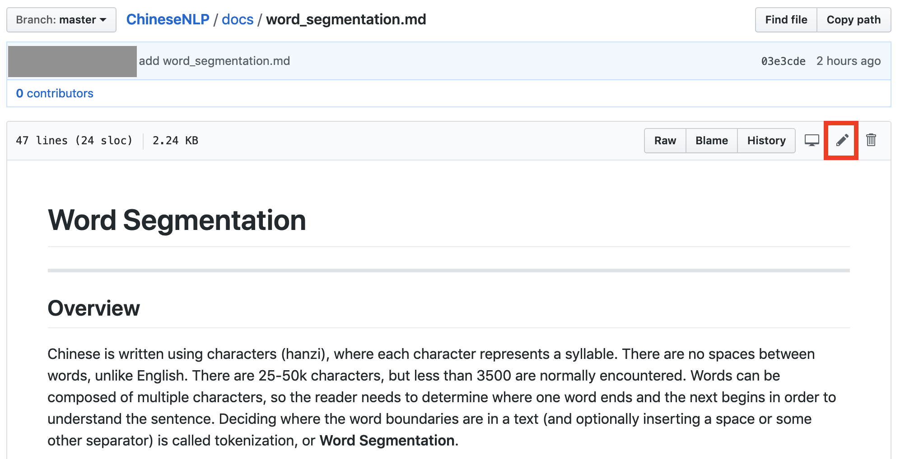
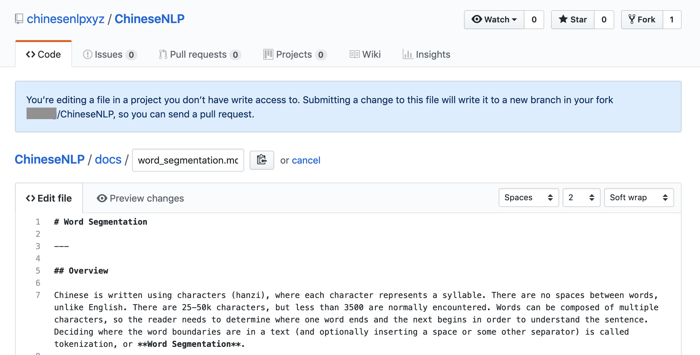
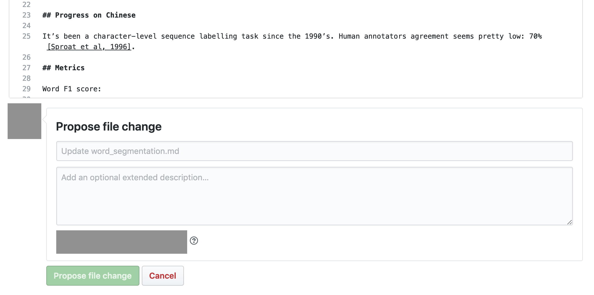

# How to contribute

---

There are two ways to contribute:
* **Edit in Github inplace**. It's suitable for small changes on exsiting markdown files.
* **Fork and pull request**. It's suitable for big changes, e.g. adding a new task.

## Edit in Github inplace

Suppose you want to change `docs/word_segmentation.md`.

* First click the `edit` button on the top right corner.



* Github will automatically fork the repo as the prompts, you can make changes in github's markdown editor.



* Once you finish editing, make sure you preview the changes. **Please write meaningful commit messages** and click `Propose file change`.



## Fork and pull request

Suppose you want to add a new page as `docs/new_task.md`

* Fork this repo.
* Clone your forked repo to your local machine

  ```	
  git clone https://github.com/YOUR_GITHUB_NAME/ChineseNLP.git	
  ```

* Build and serve this website
  * Make sure Ruby >= 2.1.0
  ```
  $ ruby --version
  > ruby 2.X.X	
  ```
  * Install Bunder
  ```
  $ gem install bundler
  ```
  * Install Jekyll
  ```
  $ bundle install
  ```
  * Serve locally
  ```
  $ bundle exec jekyll serve
  ```
  * View the website at [http://localhost:4000](http://localhost:4000)

* Adding a new file `docs/new_task.md`.
  * The new file should follow [docs/template.md](docs/template.md)
  * Add a link under section `List of Fields` in `index.md`. 
* Commit and push to your forked repo.
* Create a pull request to `chinesenlpxyz/ChineseNLP:master`.

## Useful Tools
* [Markdown Cheatsheet](https://github.com/adam-p/markdown-here/wiki/Markdown-Cheatsheet)
* [Google Sheet Table to Markdown Converter](https://chrome.google.com/webstore/detail/markdowntablemaker/cofkbgfmijanlcdooemafafokhhaeold?hl=en)
